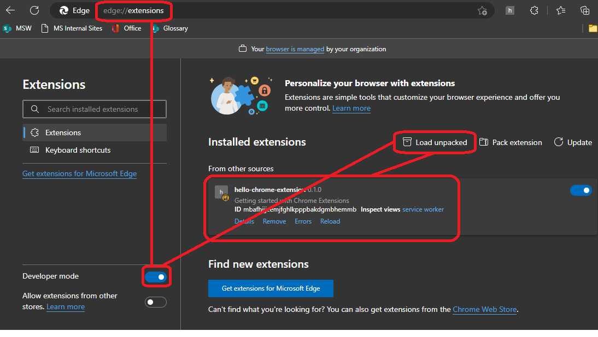
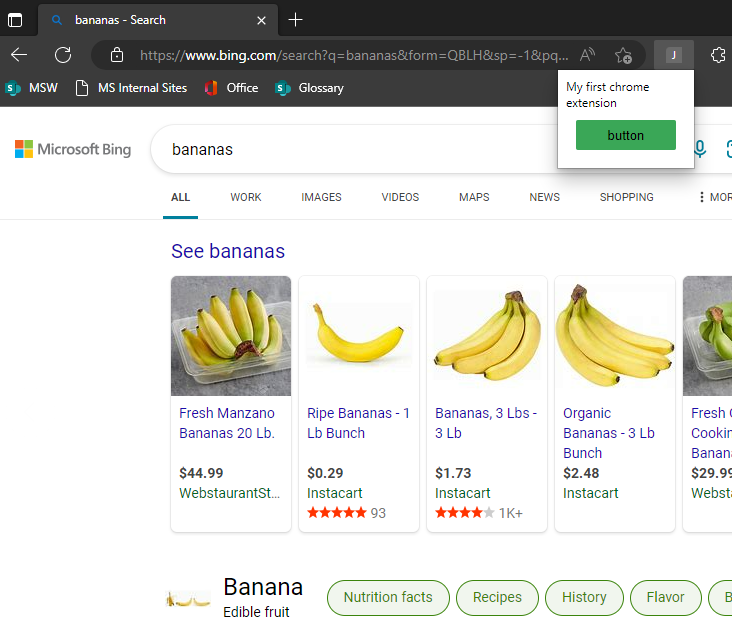
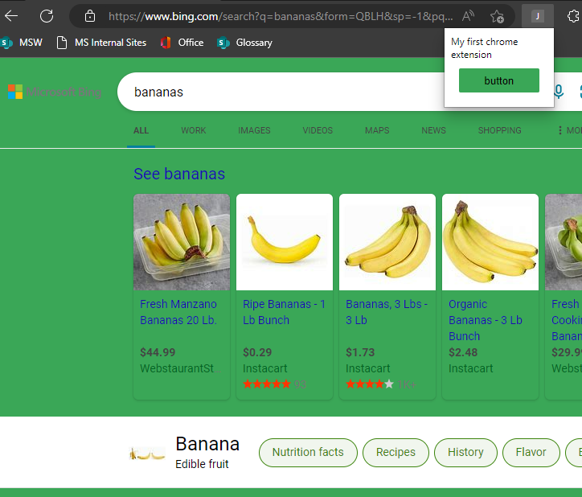
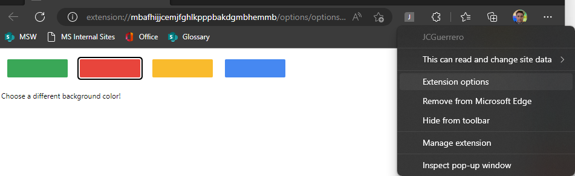
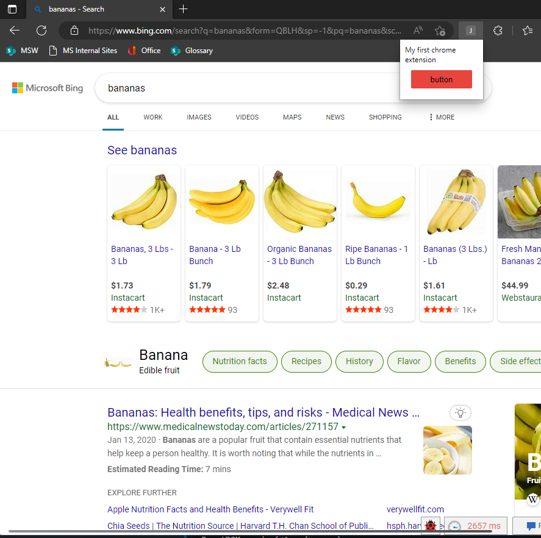
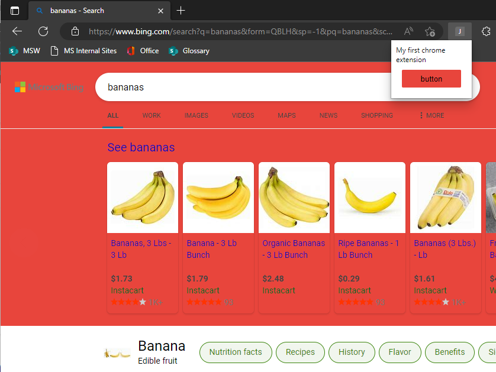

# `hello-chrome-extension`

This is a repo following the Google Developer [Getting started
](https://developer.chrome.com/docs/extensions/mv3/getstarted/)

Altho, since Edge works on chromium, `chrome` API is also available.

## Setup

### First time

```bash
$> npm run setup
```

### Dependencies

```bash
$> npm install
```

## Development

### Lint

```bash
$> npm run lint
```

### Build `dist/`

```bash
$> npm run dist
```

## Browser extension

For `chrome` | `edge`

1. `$> npm run dist`
1. Enable "Developer mode" 
1. [ Load unpacked ]
1. Select `dist/` contents

### Microsoft Edge

#### Load Extension



#### Popup: default (green background)





#### Options 



##### Popup: red background




